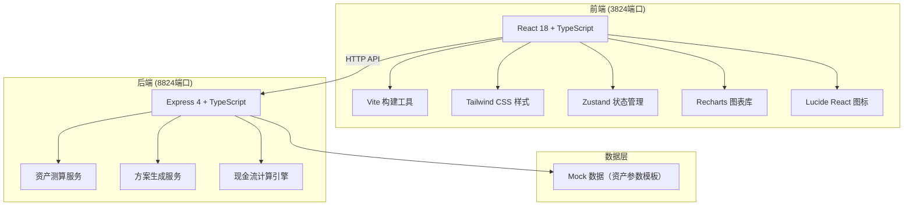
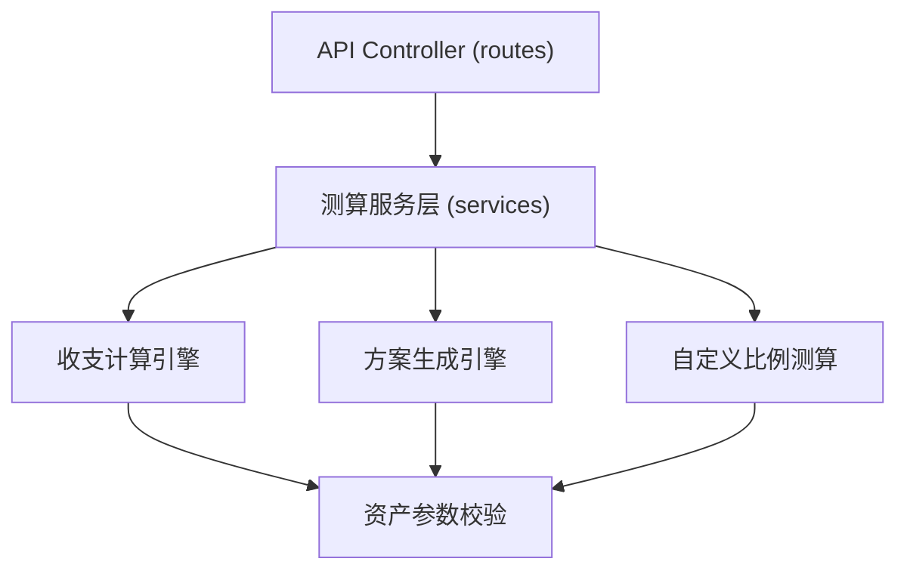

## 1. 架构设计



## 2. 技术说明

- **前端**: React@18 + TypeScript + Vite + Tailwind CSS@3 + Zustand + Recharts
- **后端**: Express@4 + TypeScript
- **初始化工具**: vite-init（react-express-ts 模板）
- **数据库**: 无数据库，使用 Mock 数据和内存计算
- **图表库**: Recharts（React 图表库，支持环形图、柱状图）
- **状态管理**: Zustand（轻量级状态管理）
- **图标**: Lucide React

## 3. 端口配置

| 服务 | 端口 | 说明 |
|-------|---------|------|
| 前端 Vite Dev Server | 3824 | 可视化交互页面 |
| 后端 Express Server | 8824 | API 服务，资产测算引擎 |

## 4. 路由定义

### 前端路由
| 路由 | 用途 |
|-------|---------|
| / | 资产测算主页（唯一页面） |

### 后端 API 路由
| 路由 | 方法 | 用途 |
|-------|------|---------|
| /api/health | GET | 健康检查 |
| /api/assets/defaults | GET | 获取默认资产参数模板 |
| /api/calculate/income | POST | 计算每月固定收支与现金流 |
| /api/calculate/plans | POST | 生成三套资产分配方案 |
| /api/calculate/custom | POST | 根据自定义比例测算收益 |

## 5. API 定义

### 5.1 资产类目与参数类型定义

```typescript
// 资产类目枚举
type AssetCategory = 'real_estate' | 'fund' | 'private_enterprise' | 'collection';

// 资产配置项
interface AssetItem {
  category: AssetCategory;
  name: string;
  selected: boolean;
  value: number;           // 资产估值（万元）
  expectedReturn: number;  // 预期年化收益率（%）
  monthlyIncome: number;   // 月固定收入（元）
  monthlyExpense: number;  // 月固定支出（元）
}

// 测算方案类型
type PlanType = 'conservative' | 'stable' | 'aggressive';

// 资产分配方案
interface AllocationPlan {
  type: PlanType;
  name: string;
  description: string;
  allocations: Record<AssetCategory, number>;  // 各类资产占比（%）
  expectedAnnualReturn: number;                 // 预期年化收益（元）
  expectedMonthlyReturn: number;                // 预期月收益（元）
  riskLevel: 'low' | 'medium' | 'high';
}

// 收支测算结果
interface IncomeResult {
  monthlyFixedIncome: number;     // 月固定收入（元）
  monthlyFixedExpense: number;    // 月固定支出（元）
  monthlyCashFlow: number;        // 月现金流（元）
  annualCashFlow: number;         // 年现金流（元）
  isSurplus: boolean;             // 是否盈余
}
```

### 5.2 请求/响应 Schema

**POST /api/calculate/income**
```typescript
// Request Body
{
  assets: AssetItem[];
}

// Response
{
  success: boolean;
  data: IncomeResult;
}
```

**POST /api/calculate/plans**
```typescript
// Request Body
{
  assets: AssetItem[];
  totalInvestment: number;  // 可投资总资产（万元）
}

// Response
{
  success: boolean;
  data: {
    conservative: AllocationPlan;
    stable: AllocationPlan;
    aggressive: AllocationPlan;
  };
}
```

**POST /api/calculate/custom**
```typescript
// Request Body
{
  assets: AssetItem[];
  totalInvestment: number;
  customAllocations: Record<AssetCategory, number>;
}

// Response
{
  success: boolean;
  data: {
    expectedAnnualReturn: number;
    expectedMonthlyReturn: number;
    allocations: Record<AssetCategory, number>;
  };
}
```

## 6. 后端服务架构



## 7. 前端项目结构

```
src/
├── components/
│   ├── AssetSelector.tsx       # 资产类目选择器
│   ├── AssetConfigPanel.tsx    # 资产参数配置面板
│   ├── IncomeOverviewCard.tsx  # 收支概览卡片
│   ├── PlanTabs.tsx            # 方案选择标签
│   ├── AllocationPieChart.tsx  # 资产分配环形图
│   ├── ReturnBarChart.tsx      # 年度收益柱状图
│   ├── RatioSlider.tsx         # 比例调节滑块
│   └── StatCard.tsx            # 通用统计卡片
├── pages/
│   └── Calculator.tsx          # 主测算页面
├── store/
│   └── useAssetStore.ts        # Zustand 状态管理
├── types/
│   └── index.ts                # 类型定义
├── utils/
│   └── api.ts                  # API 请求封装
├── App.tsx
├── main.tsx
└── index.css
```

## 8. 核心算法逻辑

### 8.1 现金流计算
```
月固定收入 = Σ(各资产月收入)
月固定支出 = Σ(各资产月支出)  
月现金流 = 月固定收入 - 月固定支出
年现金流 = 月现金流 × 12
```

### 8.2 三套方案默认分配比例
| 资产类目 | 保守型 | 稳健型 | 扩张型 |
|---------|--------|--------|--------|
| 地产 | 50% | 35% | 20% |
| 基金 | 25% | 35% | 40% |
| 私人企业 | 10% | 15% | 25% |
| 藏品 | 15% | 15% | 15% |

### 8.3 预期收益计算
```
预期年化收益 = Σ(各类资产配置金额 × 该类资产预期年化收益率)
预期月收益 = 预期年化收益 / 12
```
